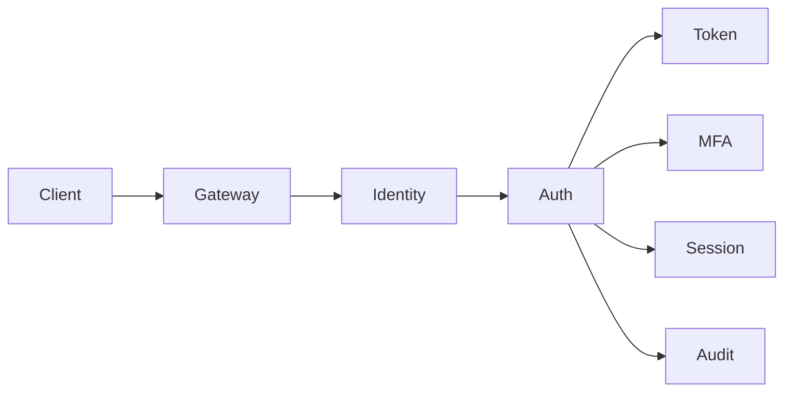

# 🔒 Design de Sistema: Sistema de Autenticação e Autorização

## 1. Requisitos & Escopo

### 1.1 Perguntas Chave
- [x] Objetivo principal: Gerenciamento de identidade e acesso
- [x] Usuários principais: Usuários finais, aplicações, serviços
- [x] Volume: 100M usuários, 1B autenticações/dia
- [x] Latência: < 100ms para auth
- [x] Disponibilidade: 99.999%

### 1.2 Requisitos Funcionais
- [x] Registro e login
- [x] OAuth2/OpenID Connect
- [x] MFA/2FA
- [x] SSO (Single Sign-On)
- [x] Gerenciamento de roles
- [x] Password reset
- [x] Session management
- [x] Social login

### 1.3 Requisitos Não-Funcionais
- [x] Disponibilidade: 99.999%
- [x] Latência: < 100ms p99
- [x] Segurança: Zero trust
- [x] Auditoria: 100% das ações
- [x] Compliance: SOC2, GDPR

### 1.4 Estimativas
- [x] TPS: ~11.5k auths/segundo
- [x] Storage: 100M * 1KB = 100GB
- [x] Cache: 20GB para sessões
- [x] Logs: 1TB/dia
- [x] Backup: 365TB/ano

### 1.5 Restrições & Limitações
- [x] Complexidade de senhas
- [x] Tempo de sessão
- [x] Rate limiting
- [x] Regulamentações
- [x] Compatibilidade

## 2. Design de Alto Nível

### 2.1 Componentes Principais
- [x] Identity Service
- [x] Authentication Service
- [x] Authorization Service
- [x] Token Service
- [x] MFA Service
- [x] Session Service
- [x] Audit Service

### 2.2 Fluxos de Dados


### 2.3 APIs & Interfaces
```typescript
interface IAuthService {
  register(user: UserRegistration): Promise<UserId>;
  login(credentials: Credentials): Promise<AuthResponse>;
  logout(sessionId: string): Promise<void>;
  validateToken(token: string): Promise<TokenInfo>;
  refreshToken(refreshToken: string): Promise<TokenPair>;
  resetPassword(email: string): Promise<void>;
}

interface AuthResponse {
  accessToken: string;
  refreshToken: string;
  expiresIn: number;
  tokenType: string;
  user: UserInfo;
}

interface TokenPair {
  accessToken: string;
  refreshToken: string;
  expiresIn: number;
}

interface UserInfo {
  id: string;
  email: string;
  roles: string[];
  permissions: string[];
  mfaEnabled: boolean;
  lastLogin: Date;
}
```

### 2.4 Modelo de Dados
- [x] Users & Auth (PostgreSQL)
```sql
CREATE TABLE users (
    id UUID PRIMARY KEY,
    email VARCHAR(255) UNIQUE NOT NULL,
    password_hash VARCHAR(255) NOT NULL,
    salt VARCHAR(32) NOT NULL,
    status VARCHAR(20) NOT NULL,
    mfa_enabled BOOLEAN DEFAULT false,
    created_at TIMESTAMP NOT NULL,
    updated_at TIMESTAMP NOT NULL
);

CREATE TABLE sessions (
    id UUID PRIMARY KEY,
    user_id UUID NOT NULL,
    refresh_token VARCHAR(255) UNIQUE,
    device_info JSONB,
    expires_at TIMESTAMP NOT NULL,
    created_at TIMESTAMP NOT NULL,
    FOREIGN KEY (user_id) REFERENCES users(id)
);

CREATE TABLE roles (
    id UUID PRIMARY KEY,
    name VARCHAR(50) UNIQUE NOT NULL,
    permissions JSONB NOT NULL,
    created_at TIMESTAMP NOT NULL
);

CREATE TABLE user_roles (
    user_id UUID NOT NULL,
    role_id UUID NOT NULL,
    granted_at TIMESTAMP NOT NULL,
    granted_by UUID NOT NULL,
    PRIMARY KEY (user_id, role_id),
    FOREIGN KEY (user_id) REFERENCES users(id),
    FOREIGN KEY (role_id) REFERENCES roles(id)
);
```

## 3. Design Detalhado

### 3.1 Tecnologias Específicas
- [x] Database: PostgreSQL
- [x] Cache: Redis
- [x] Queue: Kafka
- [x] Search: Elasticsearch
- [x] KMS: AWS KMS
- [x] WAF: Cloudflare
- [x] CDN: Cloudfront
- [x] Secrets: Vault

### 3.2 Padrões de Design
- [x] OAuth2/OIDC
- [x] JWT
- [x] PBKDF2/Bcrypt
- [x] Zero Trust
- [x] Circuit Breaker
- [x] Rate Limiter

### 3.3 Trade-offs
| Decisão | Prós | Contras | Justificativa |
|---------|------|---------|---------------|
| JWT | Stateless | Tamanho | Sem round-trip |
| PostgreSQL | ACID | Scaling | Consistência |
| Redis Session | Performance | Complexidade | Baixa latência |

## 4. Escalabilidade

### 4.1 Gargalos
- [x] Password hashing
- [x] Token validation
- [x] Session lookup
- [x] Database writes

### 4.2 Soluções
- [x] Hash caching
- [x] Token blacklist
- [x] Session sharding
- [x] Read replicas
- [x] Connection pooling

### 4.3 Custos
- [x] Infra: ~$100k/mês
  - Compute: $40k
  - Storage: $20k
  - Security: $25k
  - Others: $15k

## 5. Resiliência

### 5.1 Pontos de Falha
- [x] Database cluster
- [x] Cache cluster
- [x] Token service
- [x] MFA providers

### 5.2 Mitigações
- [x] Multi-region
- [x] Circuit breakers
- [x] Fallback auth
- [x] Graceful degradation
- [x] Hot backups

### 5.3 Monitoramento
- [x] Métricas
  - Auth success rate
  - Token validation time
  - Error rates
  - Suspicious activities
- [x] Alerting
- [x] Dashboards
- [x] Audit logs

## 6. Evolução

### 6.1 MVP
- [x] Basic auth
- [x] Simple roles
- [x] Password reset
- [x] Session mgmt

### 6.2 Melhorias Futuras
- [ ] Passwordless auth
- [ ] Biometric auth
- [ ] Risk-based auth
- [ ] Hardware keys
- [ ] Blockchain ID

### 6.3 Alternativas Consideradas
- [ ] Auth0/Okta
- [ ] Firebase Auth
- [ ] Custom OAuth
- [ ] LDAP/AD

## Notas & Observações

- Priorizar segurança
- Manter compliance
- Monitorar atividades
- Planejar recovery
- Documentar políticas 