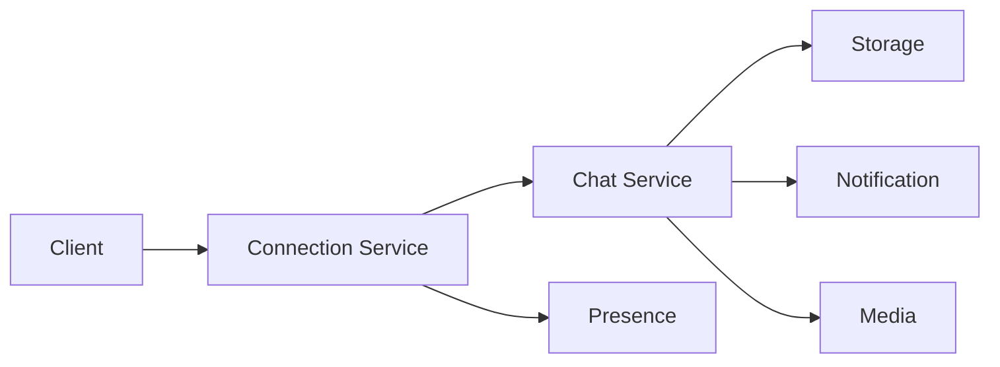

# Design de Sistema: Chat em Tempo Real

## 1. Requisitos & Escopo

### 1.1 Perguntas Chave
- [x] Objetivo principal: Sistema de mensagens em tempo real
- [x] Usuários principais: Usuários finais, Grupos, Empresas
- [x] Volume: 50M usuários ativos, 1B mensagens/dia
- [x] Latência: < 100ms para entrega
- [x] Tipos: 1:1, Grupos, Canais

### 1.2 Requisitos Funcionais
- [x] Mensagens 1:1
- [x] Grupos (até 1000 membros)
- [x] Canais (ilimitados)
- [x] Status online/offline
- [x] Indicador de digitação
- [x] Entrega garantida
- [x] Histórico de mensagens
- [x] Mídia (imagens, vídeos, arquivos)

### 1.3 Requisitos Não-Funcionais
- [x] Disponibilidade: 99.99%
- [x] Latência: < 100ms p95
- [x] Consistência: Eventual
- [x] Durabilidade: 100%
- [x] Escalabilidade: Horizontal
- [x] Segurança: E2E encryption

### 1.4 Estimativas
- [x] DAU: 50M
- [x] Mensagens: ~1B/dia
- [x] Storage: 100KB/user/dia * 50M = 5TB/dia
- [x] Conexões: 5M concurrent
- [x] Bandwidth: 1MB/user/dia * 50M = 50TB/dia

### 1.5 Restrições & Limitações
- [x] Tamanho máximo mensagem: 100KB
- [x] Retenção: 90 dias (free), 7 anos (premium)
- [x] Limite upload: 100MB/arquivo
- [x] Rate limiting por usuário
- [x] Compliance com GDPR

## 2. Design de Alto Nível

### 2.1 Componentes Principais
- [x] Connection Service (WebSocket)
- [x] Chat Service
- [x] Presence Service
- [x] Media Service
- [x] Notification Service
- [x] Storage Service
- [x] Search Service

### 2.2 Fluxos de Dados


### 2.3 APIs & Interfaces
```typescript
interface IChatService {
  sendMessage(msg: Message): Promise<MessageId>;
  getMessages(chatId: string, options: PaginationOptions): Promise<Message[]>;
  createGroup(group: GroupInfo): Promise<GroupId>;
  joinGroup(groupId: string, userId: string): Promise<void>;
  setTyping(chatId: string, isTyping: boolean): Promise<void>;
}

interface Message {
  id: string;
  chatId: string;
  senderId: string;
  content: MessageContent;
  timestamp: Date;
  status: MessageStatus;
}

interface MessageContent {
  type: 'text' | 'image' | 'video' | 'file';
  text?: string;
  mediaUrl?: string;
  metadata?: Record<string, any>;
}

interface GroupInfo {
  name: string;
  description?: string;
  members: string[];
  type: 'private' | 'public';
  metadata?: Record<string, any>;
}
```

### 2.4 Modelo de Dados
- [x] Messages Collection (Cassandra)
```sql
CREATE TABLE messages (
  chat_id uuid,
  message_id timeuuid,
  sender_id uuid,
  content text,
  media_urls list<text>,
  created_at timestamp,
  updated_at timestamp,
  status text,
  PRIMARY KEY ((chat_id), message_id)
) WITH CLUSTERING ORDER BY (message_id DESC);

CREATE TABLE chat_users (
  chat_id uuid,
  user_id uuid,
  joined_at timestamp,
  role text,
  last_read_message_id timeuuid,
  PRIMARY KEY ((chat_id), user_id)
);
```

## 3. Design Detalhado

### 3.1 Tecnologias Específicas
- [x] Backend: Node.js/TypeScript
- [x] WebSocket: Socket.io/WS
- [x] Database: Cassandra + Redis
- [x] Queue: RabbitMQ
- [x] Search: Elasticsearch
- [x] Storage: S3/GCS
- [x] CDN: CloudFront
- [x] Push: FCM/APNS

### 3.2 Padrões de Design
- [x] Publisher/Subscriber
- [x] Event Sourcing
- [x] CQRS para busca
- [x] Circuit Breaker
- [x] Rate Limiting
- [x] Backpressure handling

### 3.3 Trade-offs
| Decisão | Prós | Contras | Justificativa |
|---------|------|---------|---------------|
| WebSocket vs HTTP | Real-time, Eficiente | Complexo, Stateful | Necessidade de real-time |
| Cassandra vs MongoDB | Escala linear | Queries limitadas | Volume de writes |
| P2P vs Server | Privacidade | Complexidade | Controle e features |

## 4. Escalabilidade

### 4.1 Gargalos
- [x] Conexões WebSocket
- [x] Fanout de mensagens
- [x] Hot users/groups
- [x] Busca em histórico

### 4.2 Soluções
- [x] Connection pooling
- [x] Message queuing
- [x] Sharding por chat_id
- [x] Caching em camadas
- [x] Read replicas

### 4.3 Custos
- [x] Infra: ~$50k/mês
  - Compute: $20k
  - Storage: $15k
  - Network: $10k
  - Outros: $5k

## 5. Resiliência

### 5.1 Pontos de Falha
- [x] Conexão WebSocket
- [x] Database overload
- [x] Queue overflow
- [x] Network partition

### 5.2 Mitigações
- [x] Auto-reconnect
- [x] Message persistence
- [x] Circuit breakers
- [x] Multi-region
- [x] Graceful degradation

### 5.3 Monitoramento
- [x] Métricas
  - Latência de mensagens
  - Connected users
  - Message rate
  - Error rate
- [x] Tracing distribuído
- [x] Health checks
- [x] Alertas em tempo real

## 6. Evolução

### 6.1 MVP
- [x] Chat 1:1
- [x] Grupos básicos
- [x] Texto e imagens
- [x] Presença básica

### 6.2 Melhorias Futuras
- [ ] Video calls
- [ ] File sharing
- [ ] Message reactions
- [ ] Rich messages
- [ ] Bots platform

### 6.3 Alternativas Consideradas
- [ ] GraphQL Subscriptions
- [ ] MQTT
- [ ] gRPC Streaming
- [ ] Matrix Protocol

## Notas & Observações

- Priorizar UX em decisões técnicas
- Considerar latência global
- Implementar retry com backoff
- Monitorar uso de recursos
- Planejar para crescimento 10x 