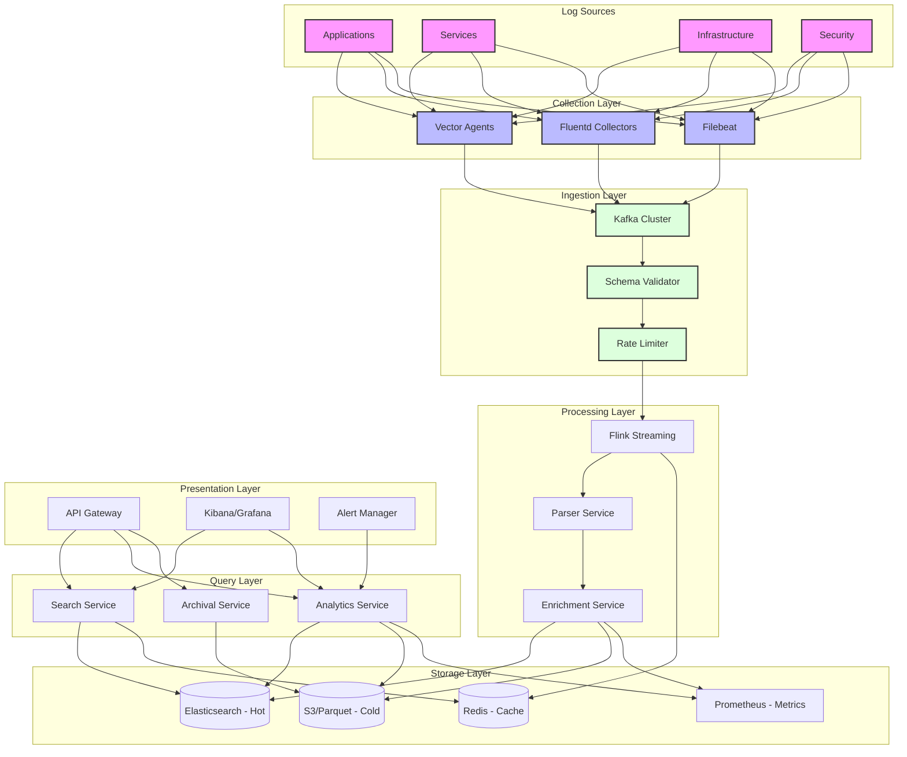

# 📊 Design de Sistema: Sistema de Processamento de Logs

```mermaid
graph TD
    subgraph Log Sources
        A[Applications]
        B[Services]
        C[Infrastructure]
        D[Security]
    end

    subgraph Collection Layer
        E[Vector Agents]
        F[Fluentd Collectors]
        G[Filebeat]
    end

    subgraph Ingestion Layer
        H[Kafka Cluster]
        I[Schema Validator]
        J[Rate Limiter]
    end

    subgraph Processing Layer
        K[Flink Streaming]
        L[Parser Service]
        M[Enrichment Service]
    end

    subgraph Storage Layer
        N[(Elasticsearch - Hot)]
        O[(S3/Parquet - Cold)]
        P[(Redis - Cache)]
        Q[Prometheus - Metrics]
    end

    subgraph Query Layer
        R[Search Service]
        S[Analytics Service]
        T[Archival Service]
    end

    subgraph Presentation Layer
        U[API Gateway]
        V[Kibana/Grafana]
        W[Alert Manager]
    end

    A & B & C & D --> E & F & G
    E & F & G --> H
    H --> I --> J
    J --> K
    K --> L --> M
    
    M --> N & O
    M --> Q
    K --> P
    
    R --> N & P
    S --> N & O & Q
    T --> O
    
    U --> R & S & T
    V --> R & S
    W --> S

    style A fill:#f9f,stroke:#333,stroke-width:2px
    style B fill:#f9f,stroke:#333,stroke-width:2px
    style C fill:#f9f,stroke:#333,stroke-width:2px
    style D fill:#f9f,stroke:#333,stroke-width:2px
    style E fill:#bbf,stroke:#333,stroke-width:2px
    style F fill:#bbf,stroke:#333,stroke-width:2px
    style G fill:#bbf,stroke:#333,stroke-width:2px
    style H fill:#dfd,stroke:#333,stroke-width:2px
    style I fill:#dfd,stroke:#333,stroke-width:2px
    style J fill:#dfd,stroke:#333,stroke-width:2px
```

## 1. Requisitos & Escopo
...