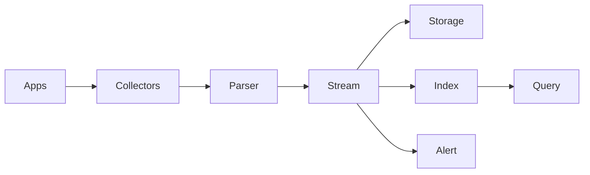

# Design de Sistema: Sistema de Processamento de Logs

## 1. Requisitos & Escopo

### 1.1 Perguntas Chave
- [x] Objetivo principal: Coleta, processamento e análise de logs em larga escala
- [x] Usuários principais: Desenvolvedores, SREs, analistas
- [x] Volume: 100TB/dia de logs
- [x] Retenção: 90 dias
- [x] Disponibilidade: 99.95%

### 1.2 Requisitos Funcionais
- [x] Ingestão de logs
- [x] Parsing & estruturação
- [x] Indexação & busca
- [x] Agregações & métricas
- [x] Alertas & notificações
- [x] Retenção & archival
- [x] Visualização

### 1.3 Requisitos Não-Funcionais
- [x] Disponibilidade: 99.95%
- [x] Latência ingestão: < 5s
- [x] Latência busca: < 3s
- [x] Durabilidade: 99.999999%
- [x] Consistência: Eventual

### 1.4 Estimativas
- [x] Volume: 100TB/dia
- [x] Throughput: 1M eventos/s
- [x] Storage: 9PB total
- [x] Network: 100Gbps
- [x] Queries: 10k/s

### 1.5 Restrições & Limitações
- [x] Custo de storage
- [x] Network bandwidth
- [x] Complexidade de queries
- [x] Tempo de retenção
- [x] Regulamentações

## 2. Design de Alto Nível

### 2.1 Componentes Principais
- [x] Collectors
- [x] Parser Service
- [x] Stream Processor
- [x] Index Service
- [x] Query Service
- [x] Storage Service
- [x] Alert Service
- [x] API Gateway

### 2.2 Fluxos de Dados


### 2.3 APIs & Interfaces
```typescript
interface ILogService {
  ingest(logs: LogEntry[]): Promise<Result>;
  search(query: Query): Promise<SearchResult>;
  aggregate(query: AggQuery): Promise<AggResult>;
  getStats(timeRange: Range): Promise<Stats>;
  createAlert(alert: Alert): Promise<void>;
  archive(criteria: Criteria): Promise<void>;
}

interface LogEntry {
  timestamp: Date;
  source: string;
  level: string;
  message: string;
  metadata: Record<string, any>;
}

interface Query {
  timeRange: Range;
  filters: Filter[];
  fields: string[];
  sort?: Sort;
  limit?: number;
}
```

### 2.4 Modelo de Dados
- [x] Log Entry
```typescript
interface LogDocument {
  id: string;          // UUID
  timestamp: number;   // Unix timestamp
  source: string;      // Log source
  level: string;       // Log level
  message: string;     // Raw message
  parsed: any;         // Parsed fields
  metadata: {          // Metadata
    host: string;
    service: string;
    version: string;
    region: string;
    tags: string[];
  };
  index: string;       // Index name
  shard: number;       // Shard number
}

interface Index {
  name: string;        // Index name
  mapping: Schema;     // Field mapping
  settings: Settings;  // Index settings
  stats: Stats;        // Index stats
}
```

## 3. Design Detalhado

### 3.1 Tecnologias Específicas
- [x] Ingestão: Vector/Fluentd
- [x] Stream: Kafka
- [x] Processing: Flink
- [x] Storage: S3 + Parquet
- [x] Index: Elasticsearch
- [x] Query: Presto
- [x] Metrics: Prometheus
- [x] Visualization: Grafana

### 3.2 Padrões de Design
- [x] Lambda Architecture
- [x] Time-based Partitioning
- [x] Write-ahead Logging
- [x] Compaction
- [x] Materialized Views
- [x] Circuit Breaker

### 3.3 Trade-offs
| Decisão | Prós | Contras | Justificativa |
|---------|------|---------|---------------|
| S3 Storage | Custo, Durabilidade | Latência | Dados frios |
| Elasticsearch | Flexibilidade | Recursos | Busca complexa |
| Parquet | Compressão | Complexidade | Análise eficiente |

## 4. Escalabilidade

### 4.1 Gargalos
- [x] Ingestão rate
- [x] Index size
- [x] Query complexity
- [x] Storage capacity

### 4.2 Soluções
- [x] Sharding
- [x] Compression
- [x] Caching
- [x] Partitioning
- [x] Query optimization

### 4.3 Custos
- [x] Infra: ~$500k/mês
  - Storage: $300k
  - Compute: $150k
  - Network: $50k

## 5. Resiliência

### 5.1 Pontos de Falha
- [x] Collectors
- [x] Message queue
- [x] Processing cluster
- [x] Storage system
- [x] Search cluster

### 5.2 Mitigações
- [x] Redundancy
- [x] Replication
- [x] Backpressure
- [x] Circuit breakers
- [x] Fallback paths

### 5.3 Monitoramento
- [x] Métricas
  - Ingest rate
  - Processing lag
  - Query latency
  - Error rate
- [x] Alerting
- [x] Dashboards
- [x] Tracing

## 6. Evolução

### 6.1 MVP
- [x] Basic ingestion
- [x] Simple parsing
- [x] Text search
- [x] Basic retention
- [x] Simple alerts

### 6.2 Melhorias Futuras
- [ ] ML anomaly detection
- [ ] Advanced analytics
- [ ] Real-time correlation
- [ ] Custom parsers
- [ ] Query optimization

### 6.3 Alternativas Consideradas
- [ ] ELK Stack
- [ ] Splunk
- [ ] Datadog
- [ ] Custom solution

## Notas & Observações

- Otimizar custos
- Monitorar performance
- Documentar schemas
- Planejar capacity
- Manter compliance 