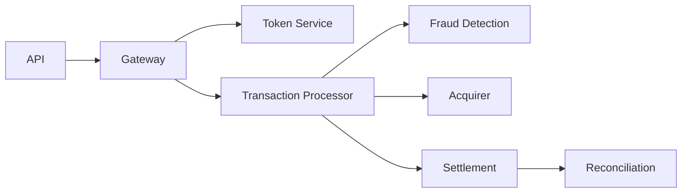

# Design de Sistema: Sistema de Processamento de Pagamentos

## 1. Requisitos & Escopo

### 1.1 Perguntas Chave
- [x] Objetivo principal: Processamento seguro e confiável de pagamentos
- [x] Usuários principais: Comerciantes, consumidores, integradores
- [x] Volume: 10M transações/dia
- [x] Latência: < 3s para autorização
- [x] Disponibilidade: 99.999%

### 1.2 Requisitos Funcionais
- [x] Processamento de cartões (crédito/débito)
- [x] Pagamentos recorrentes
- [x] Reembolsos
- [x] Disputas e chargebacks
- [x] Tokenização de cartões
- [x] Split de pagamentos
- [x] Relatórios financeiros

### 1.3 Requisitos Não-Funcionais
- [x] Disponibilidade: 99.999%
- [x] Latência: < 3s p99
- [x] Durabilidade: Zero perda de dados
- [x] Segurança: PCI DSS compliance
- [x] Auditoria: 100% das transações
- [x] Idempotência: Garantida

### 1.4 Estimativas
- [x] TPS: ~115 transações/segundo
- [x] Storage: 10M * 2KB = 20GB/dia
- [x] Bandwidth: 2KB * 115 = 230KB/s
- [x] Cache: 1GB para tokens
- [x] Backup: 7.3TB/ano

### 1.5 Restrições & Limitações
- [x] Regulamentações (PCI DSS)
- [x] SLAs com adquirentes
- [x] Limites de conexões
- [x] Timeouts de rede
- [x] Janelas de liquidação

## 2. Design de Alto Nível

### 2.1 Componentes Principais
- [x] Payment Gateway
- [x] Transaction Processor
- [x] Token Service
- [x] Fraud Detection
- [x] Settlement Service
- [x] Reconciliation Service
- [x] Reporting Service

### 2.2 Fluxos de Dados


### 2.3 APIs & Interfaces
```typescript
interface IPaymentService {
  authorize(payment: PaymentRequest): Promise<AuthResponse>;
  capture(authId: string): Promise<CaptureResponse>;
  refund(paymentId: string, amount: Money): Promise<RefundResponse>;
  void(authId: string): Promise<VoidResponse>;
  tokenize(card: CardInfo): Promise<TokenResponse>;
}

interface PaymentRequest {
  amount: Money;
  currency: string;
  card?: CardInfo;
  token?: string;
  merchantId: string;
  orderId: string;
  metadata?: Record<string, string>;
}

interface AuthResponse {
  status: 'approved' | 'declined' | 'error';
  authCode?: string;
  reason?: string;
  risk?: RiskAssessment;
  transactionId: string;
}
```

### 2.4 Modelo de Dados
- [x] Transações (PostgreSQL)
```sql
CREATE TABLE transactions (
    id UUID PRIMARY KEY,
    merchant_id UUID NOT NULL,
    amount DECIMAL(19,4) NOT NULL,
    currency VARCHAR(3) NOT NULL,
    status VARCHAR(20) NOT NULL,
    type VARCHAR(20) NOT NULL,
    card_token UUID,
    auth_code VARCHAR(10),
    created_at TIMESTAMP NOT NULL,
    updated_at TIMESTAMP NOT NULL,
    metadata JSONB,
    FOREIGN KEY (merchant_id) REFERENCES merchants(id)
);

CREATE TABLE tokens (
    id UUID PRIMARY KEY,
    merchant_id UUID NOT NULL,
    card_fingerprint VARCHAR(64) NOT NULL,
    encrypted_data BYTEA NOT NULL,
    expiry_date DATE NOT NULL,
    created_at TIMESTAMP NOT NULL,
    FOREIGN KEY (merchant_id) REFERENCES merchants(id)
);
```

## 3. Design Detalhado

### 3.1 Tecnologias Específicas
- [x] Database: PostgreSQL
- [x] Cache: Redis
- [x] Queue: RabbitMQ
- [x] HSM: AWS CloudHSM
- [x] Logs: ELK Stack
- [x] Metrics: Prometheus
- [x] Tracing: Jaeger
- [x] Secrets: Vault

### 3.2 Padrões de Design
- [x] CQRS
- [x] Event Sourcing
- [x] Saga Pattern
- [x] Circuit Breaker
- [x] Retry with Backoff
- [x] Idempotency Key

### 3.3 Trade-offs
| Decisão | Prós | Contras | Justificativa |
|---------|------|---------|---------------|
| CQRS | Escalabilidade | Complexidade | Separação de cargas |
| Event Sourcing | Auditoria | Overhead | Rastreabilidade |
| PostgreSQL | Consistência | Custo | ACID necessário |

## 4. Escalabilidade

### 4.1 Gargalos
- [x] Database writes
- [x] HSM operations
- [x] Network latency
- [x] Queue capacity

### 4.2 Soluções
- [x] Database sharding
- [x] HSM pooling
- [x] Load balancing
- [x] Queue partitioning
- [x] Caching strategy

### 4.3 Custos
- [x] Infra: ~$200k/mês
  - Compute: $80k
  - Storage: $40k
  - HSM: $40k
  - Others: $40k

## 5. Resiliência

### 5.1 Pontos de Falha
- [x] Database cluster
- [x] HSM devices
- [x] Network connectivity
- [x] Acquirer integration
- [x] Queue system

### 5.2 Mitigações
- [x] Multi-region deployment
- [x] HSM redundancy
- [x] Circuit breakers
- [x] Fallback acquirers
- [x] DLQ handling

### 5.3 Monitoramento
- [x] Métricas
  - Transaction success rate
  - Authorization latency
  - Fraud detection rate
  - Error rates
- [x] Alerting
- [x] Dashboards
- [x] Distributed tracing

## 6. Evolução

### 6.1 MVP
- [x] Basic card processing
- [x] Simple tokenization
- [x] Core reporting
- [x] Basic fraud rules

### 6.2 Melhorias Futuras
- [ ] Machine learning fraud detection
- [ ] Smart routing
- [ ] Real-time analytics
- [ ] Expanded payment methods
- [ ] Enhanced reconciliation

### 6.3 Alternativas Consideradas
- [ ] NoSQL database
- [ ] Cloud HSM only
- [ ] Third-party tokenization
- [ ] BaaS integration

## Notas & Observações

- Priorizar segurança
- Manter compliance
- Monitorar fraudes
- Otimizar custos
- Planejar DR 