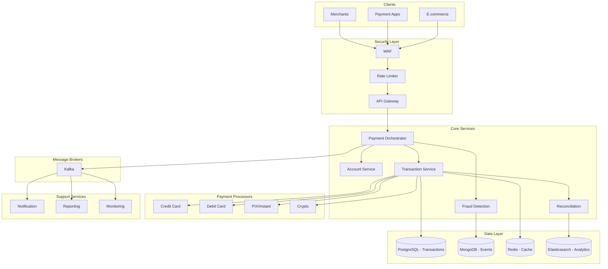
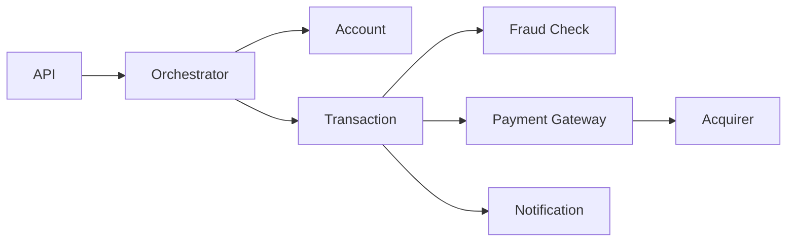

# 💳 Design de Sistema: Payment System



## 1. Requisitos & Escopo

### 1.1 Perguntas Chave
- [x] Objetivo principal: Processamento seguro de pagamentos online
- [x] Usuários principais: Compradores, Vendedores, Integradores
- [x] Volume: 1M transações/dia, $10M em volume/dia
- [x] Latência: < 3s para autorização
- [x] Disponibilidade: 99.999% (5 noves)

### 1.2 Requisitos Funcionais
- [x] Processamento de pagamentos (crédito, débito, PIX)
- [x] Gestão de carteiras digitais
- [x] Split de pagamentos
- [x] Estornos e disputas
- [x] Relatórios financeiros
- [x] Webhooks para notificações

### 1.3 Requisitos Não-Funcionais
- [x] Disponibilidade: 99.999%
- [x] Durabilidade: 100% (zero perda)
- [x] Consistência: Forte
- [x] Latência: < 3s p99
- [x] Segurança: PCI DSS compliant
- [x] Auditoria: 100% das operações

### 1.4 Estimativas
- [x] TPS: ~100 transações/segundo (pico 1000 TPS)
- [x] Storage: 1KB/transação * 1M/dia * 5 anos = 1.8TB
- [x] Bandwidth: 1KB * 100 TPS = 100KB/s
- [x] Cache: 10GB para dados quentes
- [x] Backup: Retenção de 7 anos (regulatório)

### 1.5 Restrições & Limitações
- [x] Compliance com PCI DSS
- [x] Regulamentações bancárias
- [x] Limites de processadoras
- [x] Timeouts de adquirentes
- [x] Requisitos de criptografia

## 2. Design de Alto Nível

### 2.1 Componentes Principais
- [x] API Gateway (com rate limiting)
- [x] Payment Orchestrator
- [x] Account Service
- [x] Transaction Service
- [x] Fraud Detection
- [x] Notification Service
- [x] Reconciliation Service
- [x] Reporting Service

### 2.2 Fluxos de Dados


### 2.3 APIs & Interfaces
```typescript
interface IPaymentService {
  createPayment(payment: PaymentRequest): Promise<PaymentResponse>;
  capturePayment(paymentId: string): Promise<CaptureResponse>;
  refundPayment(paymentId: string, amount: Money): Promise<RefundResponse>;
  getTransaction(transactionId: string): Promise<TransactionDetails>;
}

interface PaymentRequest {
  amount: Money;
  currency: string;
  paymentMethod: PaymentMethod;
  customer: CustomerInfo;
  metadata: Record<string, string>;
}

interface Money {
  value: number;
  currency: string;
}

interface TransactionDetails {
  id: string;
  status: TransactionStatus;
  amount: Money;
  fees: Money;
  createdAt: Date;
  updatedAt: Date;
  metadata: Record<string, string>;
}
```

### 2.4 Modelo de Dados
- [x] Transactions (PostgreSQL)
```sql
CREATE TABLE transactions (
  id UUID PRIMARY KEY,
  external_id VARCHAR(64) UNIQUE,
  status VARCHAR(32) NOT NULL,
  amount DECIMAL(20,2) NOT NULL,
  currency CHAR(3) NOT NULL,
  payment_method JSONB NOT NULL,
  customer_id UUID NOT NULL,
  merchant_id UUID NOT NULL,
  created_at TIMESTAMP NOT NULL,
  updated_at TIMESTAMP NOT NULL,
  metadata JSONB,
  CONSTRAINT fk_customer FOREIGN KEY(customer_id) REFERENCES customers(id),
  CONSTRAINT fk_merchant FOREIGN KEY(merchant_id) REFERENCES merchants(id)
);

CREATE INDEX idx_status_created ON transactions(status, created_at);
CREATE INDEX idx_merchant_created ON transactions(merchant_id, created_at);
```

## 3. Design Detalhado

### 3.1 Tecnologias Específicas
- [x] Backend: Java/Kotlin (Spring Boot)
- [x] Database: PostgreSQL + MongoDB
- [x] Cache: Redis Cluster
- [x] Queue: Kafka
- [x] Search: Elasticsearch
- [x] Monitoring: Datadog + PagerDuty
- [x] HSM: AWS CloudHSM

### 3.2 Padrões de Design
- [x] SAGA para transações distribuídas
- [x] CQRS para relatórios
- [x] Event Sourcing para auditoria
- [x] Circuit Breaker para integrações
- [x] Rate Limiting por merchant
- [x] Idempotency Keys

### 3.3 Trade-offs
| Decisão | Prós | Contras | Justificativa |
|---------|------|---------|---------------|
| SQL vs NoSQL | ACID, Consistência | Custo de scaling | Necessidade de consistência forte |
| Async vs Sync | Melhor throughput | Complexidade | Necessidade de confirmação rápida |
| Monolito vs Micro | Simplicidade inicial | Limitação de escala | Domínios bem definidos |

## 4. Escalabilidade

### 4.1 Gargalos
- [x] Picos de transações (Black Friday)
- [x] Latência de processadoras
- [x] Consistência de dados
- [x] Locks de concorrência

### 4.2 Soluções
- [x] Auto-scaling baseado em métricas
- [x] Circuit breakers inteligentes
- [x] Caching em múltiplas camadas
- [x] Sharding por merchant
- [x] Read replicas para relatórios

### 4.3 Custos
- [x] Infra: ~$100k/mês
  - Compute: $40k
  - Storage: $20k
  - Network: $10k
  - Segurança: $20k
  - Outros: $10k

## 5. Resiliência

### 5.1 Pontos de Falha
- [x] Indisponibilidade de processadora
- [x] Falha de banco de dados
- [x] Timeout em integrações
- [x] Inconsistência de dados

### 5.2 Mitigações
- [x] Multi-processadora
- [x] Database failover automático
- [x] Retry policies inteligentes
- [x] Reconciliação automática
- [x] Disaster Recovery Plan

### 5.3 Monitoramento
- [x] Métricas
  - Taxa de aprovação
  - Latência de autorização
  - Error rates
  - Chargebacks
- [x] Alertas em tempo real
- [x] Dashboards por merchant
- [x] Auditoria completa

## 6. Evolução

### 6.1 MVP
- [x] Processamento básico
- [x] Integração principal
- [x] Relatórios essenciais
- [x] Monitoramento básico

### 6.2 Melhorias Futuras
- [ ] Machine Learning para fraude
- [ ] Open Banking
- [ ] Crypto payments
- [ ] Smart routing
- [ ] BaaS (Banking as a Service)

### 6.3 Alternativas Consideradas
- [ ] Serverless architecture
- [ ] Blockchain para reconciliação
- [ ] NoSQL para tudo
- [ ] gRPC end-to-end

## Notas & Observações

- Priorizar segurança em todas decisões
- Manter compliance como primeira classe
- Monitorar custos de processamento
- Planejar para volumes 10x
- Manter documentação atualizada