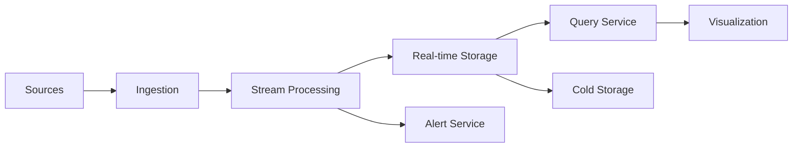

# 📈 Design de Sistema: Real-time Analytics

## 1. Requisitos & Escopo

### 1.1 Perguntas Chave
- [x] Objetivo principal: Análise de dados em tempo real
- [x] Usuários principais: Analistas, dashboards, sistemas automatizados
- [x] Volume: 1M eventos/segundo
- [x] Latência: < 1s para processamento
- [x] Disponibilidade: 99.95%

### 1.2 Requisitos Funcionais
- [x] Ingestão em tempo real
- [x] Processamento de streams
- [x] Agregações em tempo real
- [x] Alertas e notificações
- [x] Visualizações dinâmicas
- [x] APIs de consulta
- [x] Export de dados

### 1.3 Requisitos Não-Funcionais
- [x] Disponibilidade: 99.95%
- [x] Latência: < 1s p95
- [x] Consistência: Eventual
- [x] Durabilidade: Garantida
- [x] Escalabilidade: Horizontal

### 1.4 Estimativas
- [x] EPS: 1M eventos/segundo
- [x] Storage: 1M * 1KB * 86400 = 86TB/dia
- [x] Processamento: 1M * 100μs = 100s CPU/s
- [x] Memória: 100GB para hot data
- [x] Network: 1KB * 1M = 1GB/s

### 1.5 Restrições & Limitações
- [x] Janela de retenção
- [x] Complexidade de queries
- [x] Recursos computacionais
- [x] Latência de rede
- [x] Custo de storage

## 2. Design de Alto Nível

### 2.1 Componentes Principais
- [x] Ingestion Service
- [x] Stream Processing
- [x] Storage Service
- [x] Query Service
- [x] Alert Service
- [x] Visualization Service
- [x] API Gateway

### 2.2 Fluxos de Dados


### 2.3 APIs & Interfaces
```typescript
interface IAnalyticsService {
  ingest(events: Event[]): Promise<IngestResult>;
  query(query: Query): Promise<QueryResult>;
  getMetrics(metric: string, options: MetricOptions): Promise<MetricData>;
  createAlert(alert: AlertConfig): Promise<AlertId>;
  getDashboard(id: string): Promise<Dashboard>;
}

interface Event {
  id: string;
  timestamp: Date;
  type: string;
  source: string;
  data: Record<string, any>;
  metadata: Record<string, any>;
}

interface Query {
  metrics: string[];
  filters: Filter[];
  groupBy: string[];
  timeRange: TimeRange;
  aggregations: Aggregation[];
}

interface AlertConfig {
  metric: string;
  condition: Condition;
  threshold: number;
  window: Duration;
  actions: Action[];
}
```

### 2.4 Modelo de Dados
- [x] Eventos & Métricas (ClickHouse)
```sql
CREATE TABLE events (
    event_id UUID,
    timestamp DateTime64(3),
    event_type LowCardinality(String),
    source LowCardinality(String),
    data JSON,
    metadata JSON,
    INDEX idx_type event_type TYPE bloom_filter(0.01) GRANULARITY 1,
    INDEX idx_source source TYPE bloom_filter(0.01) GRANULARITY 1
) ENGINE = MergeTree()
PARTITION BY toYYYYMM(timestamp)
ORDER BY (timestamp, event_type, event_id);

CREATE TABLE metrics (
    metric_name LowCardinality(String),
    timestamp DateTime64(3),
    dimensions JSON,
    value Float64,
    count UInt64,
    PRIMARY KEY (metric_name, timestamp)
) ENGINE = AggregatingMergeTree()
PARTITION BY toYYYYMM(timestamp)
ORDER BY (metric_name, timestamp);
```

## 3. Design Detalhado

### 3.1 Tecnologias Específicas
- [x] Ingestion: Kafka
- [x] Processing: Flink
- [x] Storage: ClickHouse
- [x] Cache: Redis
- [x] Queue: RabbitMQ
- [x] Visualization: Grafana
- [x] Search: Elasticsearch
- [x] Cold Storage: S3

### 3.2 Padrões de Design
- [x] Lambda Architecture
- [x] Stream Processing
- [x] CQRS
- [x] Event Sourcing
- [x] Materialized Views
- [x] Circuit Breaker

### 3.3 Trade-offs
| Decisão | Prós | Contras | Justificativa |
|---------|------|---------|---------------|
| ClickHouse | Performance | Complexidade | Análise em tempo real |
| Lambda Arch | Flexibilidade | Overhead | Batch + Stream |
| Kafka | Throughput | Custo | Alta escala |

## 4. Escalabilidade

### 4.1 Gargalos
- [x] Ingestão de dados
- [x] Processamento de streams
- [x] Query performance
- [x] Storage IOPS

### 4.2 Soluções
- [x] Particionamento
- [x] Parallel processing
- [x] Query optimization
- [x] Data pruning
- [x] Caching strategy

### 4.3 Custos
- [x] Infra: ~$300k/mês
  - Compute: $100k
  - Storage: $100k
  - Network: $50k
  - Others: $50k

## 5. Resiliência

### 5.1 Pontos de Falha
- [x] Ingestion pipeline
- [x] Processing cluster
- [x] Storage cluster
- [x] Query service

### 5.2 Mitigações
- [x] Multi-AZ deployment
- [x] Data replication
- [x] Circuit breakers
- [x] Backpressure
- [x] Dead letter queues

### 5.3 Monitoramento
- [x] Métricas
  - Ingest latency
  - Processing lag
  - Query latency
  - Error rates
- [x] Alerting
- [x] Dashboards
- [x] Tracing

## 6. Evolução

### 6.1 MVP
- [x] Basic ingestion
- [x] Simple processing
- [x] Core metrics
- [x] Basic queries

### 6.2 Melhorias Futuras
- [ ] ML analytics
- [ ] Predictive alerts
- [ ] Query optimization
- [ ] Custom processing
- [ ] Advanced viz

### 6.3 Alternativas Consideradas
- [ ] Druid
- [ ] TimescaleDB
- [ ] Prometheus
- [ ] Custom solution

## Notas & Observações

- Otimizar queries
- Monitorar custos
- Manter SLAs
- Documentar pipelines
- Planejar capacidade 