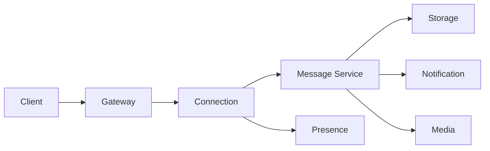

# Design de Sistema: Sistema de Mensagens em Tempo Real

## 1. Requisitos & Escopo

### 1.1 Perguntas Chave
- [x] Objetivo principal: Mensagens em tempo real entre usuários
- [x] Usuários principais: Usuários finais, aplicações cliente
- [x] Volume: 50M usuários ativos, 1B mensagens/dia
- [x] Latência: < 100ms para entrega
- [x] Disponibilidade: 99.99%

### 1.2 Requisitos Funcionais
- [x] Mensagens 1:1
- [x] Grupos de chat
- [x] Status de entrega/leitura
- [x] Histórico de mensagens
- [x] Notificações push
- [x] Mídia (imagens, vídeos, arquivos)
- [x] Presença online

### 1.3 Requisitos Não-Funcionais
- [x] Disponibilidade: 99.99%
- [x] Latência: < 100ms p95
- [x] Consistência: Eventual
- [x] Durabilidade: Garantida
- [x] Segurança: E2E encryption

### 1.4 Estimativas
- [x] TPS: ~11.5k mensagens/segundo
- [x] Storage: 1B * 1KB = 1TB/dia
- [x] Bandwidth: 1KB * 11.5k = 11.5MB/s
- [x] Cache: 10GB para sessões
- [x] Backup: 365TB/ano

### 1.5 Restrições & Limitações
- [x] Tamanho máximo de mensagem
- [x] Limite de membros por grupo
- [x] Retenção de dados
- [x] Latência de rede
- [x] Regulamentações (GDPR)

## 2. Design de Alto Nível

### 2.1 Componentes Principais
- [x] Connection Service
- [x] Message Service
- [x] Presence Service
- [x] Notification Service
- [x] Media Service
- [x] Storage Service
- [x] API Gateway

### 2.2 Fluxos de Dados


### 2.3 APIs & Interfaces
```typescript
interface IMessageService {
  sendMessage(message: Message): Promise<MessageId>;
  getMessages(chatId: string, options: PaginationOptions): Promise<Message[]>;
  updateStatus(messageId: string, status: MessageStatus): Promise<void>;
  deleteMessage(messageId: string): Promise<void>;
  createChat(chat: ChatConfig): Promise<ChatId>;
}

interface Message {
  id: string;
  chatId: string;
  senderId: string;
  content: MessageContent;
  timestamp: Date;
  status: MessageStatus;
  metadata: Record<string, any>;
}

interface MessageContent {
  type: 'text' | 'image' | 'video' | 'file';
  data: string;
  mediaUrl?: string;
  mimeType?: string;
}

interface ChatConfig {
  type: 'direct' | 'group';
  participants: string[];
  metadata?: Record<string, any>;
}
```

### 2.4 Modelo de Dados
- [x] Mensagens (Cassandra)
```sql
CREATE TABLE messages (
    chat_id uuid,
    message_id timeuuid,
    sender_id uuid,
    content text,
    content_type text,
    media_url text,
    status text,
    created_at timestamp,
    metadata map<text, text>,
    PRIMARY KEY ((chat_id), message_id)
) WITH CLUSTERING ORDER BY (message_id DESC);

CREATE TABLE chat_participants (
    chat_id uuid,
    user_id uuid,
    joined_at timestamp,
    role text,
    last_read_message_id timeuuid,
    PRIMARY KEY ((chat_id), user_id)
);
```

## 3. Design Detalhado

### 3.1 Tecnologias Específicas
- [x] WebSocket: Socket.IO
- [x] Database: Cassandra
- [x] Cache: Redis
- [x] Queue: Kafka
- [x] Storage: S3
- [x] CDN: CloudFront
- [x] Push: Firebase
- [x] Search: Elasticsearch

### 3.2 Padrões de Design
- [x] Publisher/Subscriber
- [x] Event Sourcing
- [x] CQRS
- [x] Circuit Breaker
- [x] Backpressure
- [x] Fan-out/Fan-in

### 3.3 Trade-offs
| Decisão | Prós | Contras | Justificativa |
|---------|------|---------|---------------|
| WebSocket | Real-time | Complexidade | Baixa latência |
| Cassandra | Escalabilidade | Consistência | Volume de dados |
| E2E Encryption | Segurança | Performance | Privacidade |

## 4. Escalabilidade

### 4.1 Gargalos
- [x] WebSocket connections
- [x] Message fanout
- [x] Media upload/download
- [x] Database writes

### 4.2 Soluções
- [x] Connection pooling
- [x] Message batching
- [x] CDN caching
- [x] Data partitioning
- [x] Load balancing

### 4.3 Custos
- [x] Infra: ~$150k/mês
  - Compute: $50k
  - Storage: $40k
  - CDN: $30k
  - Others: $30k

## 5. Resiliência

### 5.1 Pontos de Falha
- [x] Connection servers
- [x] Message queue
- [x] Database cluster
- [x] Media storage

### 5.2 Mitigações
- [x] Multi-region deployment
- [x] Message persistence
- [x] Auto-reconnect
- [x] Circuit breakers
- [x] Rate limiting

### 5.3 Monitoramento
- [x] Métricas
  - Message latency
  - Connection count
  - Delivery rate
  - Error rates
- [x] Alerting
- [x] Dashboards
- [x] Tracing

## 6. Evolução

### 6.1 MVP
- [x] Basic messaging
- [x] Simple groups
- [x] Text only
- [x] Basic presence

### 6.2 Melhorias Futuras
- [ ] Rich media
- [ ] Message reactions
- [ ] Thread replies
- [ ] Voice/video calls
- [ ] Bots platform

### 6.3 Alternativas Consideradas
- [ ] MQTT protocol
- [ ] GraphQL subscriptions
- [ ] Server-sent events
- [ ] Firebase only

## Notas & Observações

- Priorizar experiência
- Garantir privacidade
- Otimizar latência
- Monitorar escalabilidade
- Planejar capacidade 